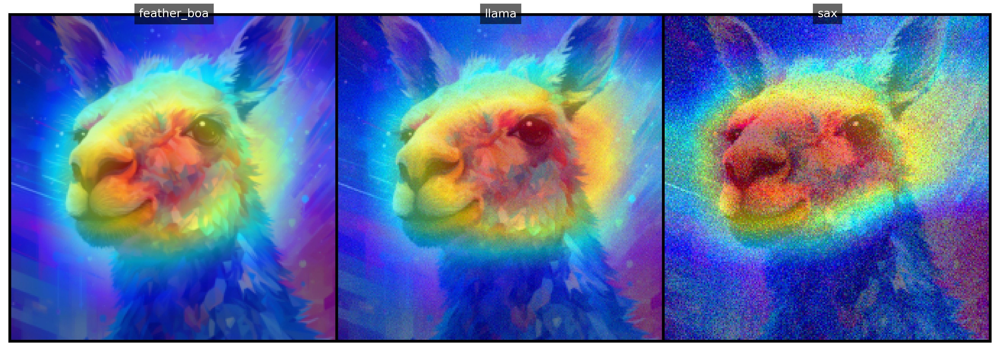

<a name="readme-top"></a>

<!-- PROJECT SHIELDS -->


<!-- PROJECT TITLE -->
# [Robustness of Image Classifiers Explanations to Adversarial Attacks and Perturbations](#readme-top)

<div align="center">

## 🤖 Explainable and Reliable Artificial Intelligence  
#### 📚 University of Trieste, Academic Year 2024–2025  
#### 🎓 Data Science and Artificial Intelligence Master's Program  

[](https://github.com/luispky/XAI-RAI-UniTS)

</div>

---

<details>
<summary><strong>Table of Contents</strong> (Click to expand)</summary>

- [Robustness of Image Classifiers Explanations to Adversarial Attacks and Perturbations](#robustness-of-image-classifiers-explanations-to-adversarial-attacks-and-perturbations)
  - [🤖 Explainable and Reliable Artificial Intelligence](#-explainable-and-reliable-artificial-intelligence)
      - [📚 University of Trieste, Academic Year 2024–2025](#-university-of-trieste-academic-year-20242025)
      - [🎓 Data Science and Artificial Intelligence Master's Program](#-data-science-and-artificial-intelligence-masters-program)
  - [Authors Information](#authors-information)
  - [About the Project](#about-the-project)
    - [Project Description](#project-description)
    - [Project Structure](#project-structure)
    - [Slides](#slides)
    - [Built With](#built-with)
  - [Getting Started](#getting-started)
    - [Prerequisites](#prerequisites)
      - [Manual Installation](#manual-installation)
      - [Conda Environment](#conda-environment)
  - [Usage](#usage)
    - [`explanations_perturbed_images.py`](#explanations_perturbed_imagespy)
      - [Command-Line Arguments](#command-line-arguments)
      - [Example Usage](#example-usage)
    - [Supported Methods and Models](#supported-methods-and-models)
      - [Methods](#methods)
      - [Models](#models)
    - [`main.py`](#mainpy)
      - [Perturbation Techniques](#perturbation-techniques)
      - [Example Usage](#example-usage-1)
  - [License](#license)

</details>

---

## Authors Information

This project was developed by the following students:

| 👤 Name           | Surname         | 🎓 Student ID | 📧 UniTS Email                                 | 📧 Gmail                     |
|-------------------|-----------------|---------------|-----------------------------------------------|-----------------------------|
| Omar             | Cusma Fait      | SM3800018     | omar.cusmafait@studenti.units.it             | omar.cusma.fait@gmail.com   |
| Luis Fernando    | Palacios Flores | SM3800038     | luisfernando.palaciosflores@studenti.units.it | lf.palaciosf@gmail.com      |

---

## About the Project

### Project Description

🔍 This project investigates the robustness of popular computer vision models trained on the ImageNet dataset—AlexNet, ResNet50, Vision Transformer (ViT), and Swin Transformer—against adversarial attacks and perturbations. It also inspects the reliability of the explanations these models generate under such conditions.

### Project Structure

📂 The project is organized into the following structure:

```plaintext
├── data
│   ├── imagenet_classes.txt        # ImageNet class labels
│   ├── imagenet_class_index.json   # JSON with class indices
│   └── images                      # Sample test images
├── README.md                       # Project documentation
├── requirements.txt                # Python dependencies
├── xai-env.yml                     # Conda environment configuration
└── xai_rai_units                   # Source code and scripts
    ├── __init__.py                 # Package initializer
    ├── scripts
    │   ├── explanations_perturbed_images.py  # Generate visual explanations
    │   ├── main.py                             # Evaluate model robustness
    └── src                         # Core functionality and utilities
```

- **`data/`**: Contains ImageNet class indices and sample test images.
- **`requirements.txt`**: Lists Python dependencies needed for the project.
- **`xai-env.yml`**: YAML configuration file for setting up a Conda environment.
- **`xai_rai_units/`**: Contains all source code and scripts:
  - **`scripts/`**: Includes executable Python scripts.
    - `explanations_perturbed_images.py`: Generates visual explanations for perturbed images.
    - `main.py`: Main script to evaluate model robustness.
  - **`src/`**: Core source code and utilities for the project.

### Slides

📑 View the project presentation slides [here](https://docs.google.com/presentation/d/1MeYbksuf-NYsq2r8V-fL1dgzV7CjD_gLuu2tUy_T4Pw/edit?usp=sharing).

### Built With

🛠️ This project leverages the following tools and libraries:

- 
- 
- 
- 
- 

---

## Getting Started

Follow these steps to set up the project environment. 🚀

### Prerequisites

Install dependencies manually or using a Conda environment.

#### Manual Installation

📦 Use `pip` to install dependencies from `requirements.txt`:

```bash
pip install -r requirements.txt
```

#### Conda Environment

🐍 Create and activate a Conda environment:

```bash
conda env create -f xai-env.yml
conda activate xai-env
```

<p align="right">(<a href="#readme-top">back to top</a>)</p>

---

## Usage

### `explanations_perturbed_images.py`

This script generates visual explanations for images using Explainable AI (XAI) methods such as Grad-CAM and Captum. The script applies noise to images, visualizes model explanations for both original and perturbed images for the fraction of noise that causes prediction changes. The fractions of noise that cause prediction changes are displayed on the console.

#### Command-Line Arguments

| Argument             | Type   | Default  | Description                                                                                   |
|-----------------------|--------|----------|-----------------------------------------------------------------------------------------------|
| `--library`           | `str`  | "gradcam" | Library for generating explanations (`gradcam` or `captum`).                                  |
| `--method`            | `str`  | "GradCAM" | Explanation method (e.g., `GradCAM`, `LayerGradCam`).                                         |
| `--model_name`        | `str`  | "resnet50" | Pre-trained model to use (`alexnet`, `resnet50`, etc.).                                       |
| `--sample_images`     | `int`  | 5         | Number of images to process.                                                                 |
| `--n_perturbations`   | `int`  | 5         | Number of perturbed images to generate for analysis.                                          |
| `--magnitude`         | `float`| 0.2       | Maximum noise magnitude for image perturbation.                                               |
| `--seed`              | `int`  | 24        | Random seed for reproducibility.                                                             |

#### Example Usage

```bash
python xai_rai_units/scripts/explanations_perturbed_images.py \
  --library gradcam \
  --method GradCAM \
  --model_name resnet50 \
  --sample_images 5 \
  --n_perturbations 5 \
  --magnitude 0.2 \
  --seed 24
```

---

### Supported Methods and Models

#### Methods

| 🔍 Grad-CAM Variants | 🎯 Captum Methods      |
|-----------------------|-----------------------|
| GradCAM              | LayerGradCam         |
| GradCAM++            | DeepLift             |
| XGradCAM             | LayerConductance     |
| EigenCAM             | GuidedGradCam        |
| HiResCAM             | DeepLiftSHAP         |

#### Models

| 📊 Model Name         | 🖥️ Code               |
|-----------------------|-----------------------|
| AlexNet              | `alexnet`            |
| ResNet50             | `resnet50`           |
| Swin Transformer     | `swin_transformer`   |
| Vision Transformer   | `vit`                |

---

### `main.py`

This script evaluates the robustness of models to adversarial attacks and perturbations. It processes a set of images, applies various perturbation techniques, and visualizes both original and perturbed image explanations. It also identifies the smallest noise fraction that causes prediction changes.

#### Perturbation Techniques

- **Identity Perturbation**: 🪞 Produces identical images without any modifications as a baseline for comparison.
- **Gaussian Noise**: 📈 Adds random noise to the image.
- **Image Blurring**: 📷 Gradually reduces image sharpness.
- **Occlusion**: 🌓 Adds black rectangles to obscure parts of the image.
- **Void Perturbation**: 🌫️ Gradually darkens edges towards the center.
- **Opposite Gradient**: 🔀 Alters the image using gradients of the opposite direction.

These techniques add noise to the image (in <font color='red'>pixel space $[0, 1]$</font>)  in a fixed random direction producing a sequence of perturbed images until the desired noise magnitude.

#### Example Usage

```bash
python xai_rai_units/scripts/main.py
```

<p align="right">(<a href="#readme-top">back to top</a>)</p>

---

## License

⚖️ This project is distributed under the project license. Refer to `LICENSE.txt` for details.

<p align="right">(<a href="#readme-top">back to top</a>)</p>

---

<!-- REFERENCES -->
<!-- ## References -->

<!-- <a id="ref1"></a> -->


<!-- <p align="right">(<a href="#readme-top">back to top</a>)</p>

--- -->

<!-- ACKNOWLEDGMENTS -->
<!-- ## Acknowledgments


<p align="right">(<a href="#readme-top">back to top</a>)</p> -->

<!-- MARKDOWN LINKS & IMAGES -->
<!-- https://www.markdownguide.org/basic-syntax/#reference-style-links -->
