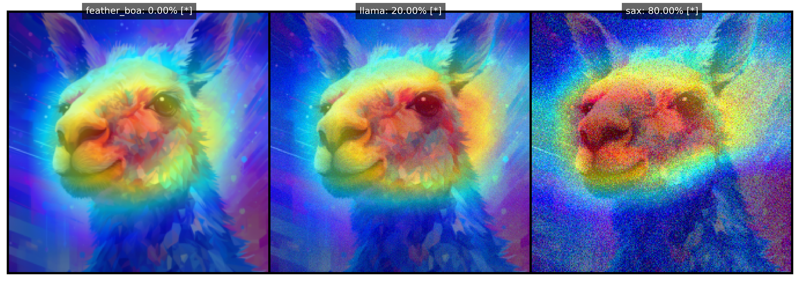

<a name="readme-top"></a>

<!-- PROJECT SHIELDS -->


<!-- PROJECT TITLE -->
# [Robustness of Image Classifiers Explanations to Adversarial Attacks and Perturbations](#readme-top)

<div align="center">

## 🤖 Explainable and Reliable Artificial Intelligence  
#### 📚 University of Trieste, Academic Year 2024–2025  
#### 🎓 Data Science and Artificial Intelligence Master's Program  

[](https://github.com/luispky/XAI-RAI-UniTS)

</div>

---

<details>
<summary><strong>Table of Contents</strong> (Click to expand)</summary>

- [Robustness of Image Classifiers Explanations to Adversarial Attacks and Perturbations](#robustness-of-image-classifiers-explanations-to-adversarial-attacks-and-perturbations)
  - [🤖 Explainable and Reliable Artificial Intelligence](#-explainable-and-reliable-artificial-intelligence)
      - [📚 University of Trieste, Academic Year 2024–2025](#-university-of-trieste-academic-year-20242025)
      - [🎓 Data Science and Artificial Intelligence Master's Program](#-data-science-and-artificial-intelligence-masters-program)
  - [Authors Information](#authors-information)
  - [About the Project](#about-the-project)
    - [Project Description](#project-description)
    - [Project Structure](#project-structure)
    - [Slides](#slides)
    - [Built With](#built-with)
  - [Getting Started](#getting-started)
    - [Prerequisites](#prerequisites)
      - [Manual Installation](#manual-installation)
      - [Conda Environment](#conda-environment)
    - [Environment Configuration](#environment-configuration)
  - [Usage](#usage)
    - [`explanations_perturbed_images.py`](#explanations_perturbed_imagespy)
      - [Command-Line Arguments](#command-line-arguments)
      - [Example Usage](#example-usage)
    - [Supported Methods and Models](#supported-methods-and-models)
      - [Methods](#methods)
      - [Models](#models)
    - [`main.py`](#mainpy)
      - [Overview](#overview)
      - [Perturbation Techniques](#perturbation-techniques)
      - [Example Usage](#example-usage-1)
  - [License](#license)
  - [Acknowledgments](#acknowledgments)

</details>

---

## Authors Information

This project was developed by the following students:

| 👤 Name           | Surname         | 🎓 Student ID | 📧 UniTS Email                                 | 📧 Gmail                     |
|-------------------|-----------------|---------------|-----------------------------------------------|-----------------------------|
| Omar             | Cusma Fait      | SM3800018     | omar.cusmafait@studenti.units.it             | omar.cusma.fait@gmail.com   |
| Luis Fernando    | Palacios Flores | SM3800038     | luisfernando.palaciosflores@studenti.units.it | lf.palaciosf@gmail.com      |

---

## About the Project

> **ℹ️ Generative Tools Notice ℹ️**  
> Generative AI tools have assisted in this project's development. Specifically, they helped to refine code readability, clarify tool functionality, fix minor bugs, write documentation, and improve overall clarity. Nonetheless, the authors remain the primary creators of the ideas and retain full ownership of the creative process.

### Project Description

🔍 This project investigates the robustness of popular computer vision models trained on the ImageNet dataset—AlexNet, ResNet50, Vision Transformer (ViT), and Swin Transformer—against adversarial attacks and perturbations. It also inspects the reliability of the explanations these models generate under such conditions.

### Project Structure

📂 The project is organized into the following structure:

```plaintext
├── data
│   ├── imagenet_classes.txt        # ImageNet class labels
│   ├── imagenet_class_index.json   # JSON with class indices
│   └── images                      # Sample test images
├── README.md                       # Project documentation
├── requirements.txt                # Python dependencies
├── xai-env.yml                     # Conda environment configuration
└── xai_rai_units                   # Source code and scripts
    ├── __init__.py                 # Package initializer
    ├── scripts
    │   ├── explanations_perturbed_images.py  # Generate visual explanations
    │   ├── main.py                             # Evaluate model robustness
    └── src                         # Core functionality and utilities
```

- **`data/`**: Contains ImageNet class indices and sample test images.
- **`requirements.txt`**: Lists Python dependencies needed for the project.
- **`xai-env.yml`**: YAML configuration file for setting up a Conda environment.
- **`explanations_config.yaml`**: Configuration file for the `results_gen_explanations_noisy_images.py` script.
- **`xai_rai_units/`**: Contains all source code and scripts:
  - **`scripts/`**: Includes executable Python scripts.
    - `explanations_perturbed_images.py`: Generates visual explanations for perturbed images.
    - `main.py`: Main script to evaluate model robustness.
  - - `results_gen_explanations_noisy_images.py`: Script to save results of explanations for noisy images.
  - **`src/`**: Core source code and utilities for the project.

### Slides

📑 View the project presentation slides [here](https://docs.google.com/presentation/d/1MeYbksuf-NYsq2r8V-fL1dgzV7CjD_gLuu2tUy_T4Pw/edit?usp=sharing).

### Built With

🛠️ This project leverages the following tools and libraries:

- 
- 
- 
- 
- 

---

## Getting Started

Follow these steps to set up the project environment. 🚀

### Prerequisites

Install dependencies manually or using a Conda environment.

#### Manual Installation

📦 Use `pip` to install dependencies from `requirements.txt`:

```bash
pip install -r requirements.txt
```

#### Conda Environment

🐍 Create and activate a Conda environment:

```bash
conda env create -f xai-env.yml
conda activate xai-env
```

### Environment Configuration

<details>
<summary><strong>Click to expand for detailed environment setup instructions 🤓</strong></summary>

To ensure that all scripts run correctly, make sure your environment is set up properly:

1. **PYTHONPATH**:  
   Set the `PYTHONPATH` environment variable to include the root of this project. For example:
   ```bash
   export PYTHONPATH=$PYTHONPATH:/path/to/XAI-RAI-UniTS
   ```
   This allows Python to locate modules and packages within the `xai_rai_units` folder.

2. **Conda Environment in PATH**:  
   Ensure the path to your Conda environment is in your `PATH`. For example:
   ```bash
   export PATH=/path/to/anaconda3/envs/xai-env/bin:$PATH
   ```
   This helps ensure you are calling the correct Python interpreter and installed dependencies.

3. **VSCode Integration (Optional)**:  
   If you are using Visual Studio Code with Conda, you can automate these environment variables:
   - Create a `.env` file in the root of the project with the following content:
     ```plaintext
     PYTHONPATH=/path/to/XAI-RAI-UniTS
     ```
   - Create or update `.vscode/settings.json` with:
     ```json
     {
       "python.pythonPath": "/path/to/anaconda3/envs/xai-env/bin/python",
       "python.envFile": "${workspaceFolder}/.env"
     }
     ```
   With this setup, VSCode will automatically use your Conda environment and the specified Python path whenever you open this workspace.

</details>

---

## Usage

### `explanations_perturbed_images.py`

This script generates visual explanations for images using Explainable AI (XAI) methods such as Grad-CAM and Captum. The script applies noise to images, visualizes model explanations for both original and perturbed images, and displays the fractions of noise that cause prediction changes in the console.

#### Command-Line Arguments

| Argument             | Type   | Default   | Description                                                                                   |
|----------------------|--------|-----------|-----------------------------------------------------------------------------------------------|
| `--library`          | `str`  | "gradcam" | Library for generating explanations (`gradcam` or `captum`).                                  |
| `--method`           | `str`  | "GradCAM" | Explanation method (e.g., `GradCAM`, `LayerGradCam`).                                         |
| `--model_name`       | `str`  | "resnet50"| Pre-trained model to use (`alexnet`, `resnet50`, etc.).                                       |
| `--sample_images`    | `int`  | 5         | Number of images to process.                                                                  |
| `--perturbation_name`| `str`  | "Gaussian"| Name of the perturbation method to use (e.g., `Identity`, `Blur`).                            |
| `--n_perturbations`  | `int`  | 5         | Number of perturbed images to generate for analysis.                                          |
| `--magnitude`        | `float`| 0.2       | Maximum noise magnitude for image perturbation.                                               |
| `--seed`             | `int`  | 24        | Random seed for reproducibility.                                                              |

#### Example Usage

```bash
python xai_rai_units/scripts/explanations_perturbed_images.py \
  --library gradcam \
  --method GradCAM \
  --model_name resnet50 \
  --sample_images 5 \
  --perturbation_name Gaussian \
  --n_perturbations 5 \
  --magnitude 0.2 \
  --seed 24
```

---

### Supported Methods and Models

#### Methods

| 🔍 Grad-CAM Variants | 🎯 Captum Methods     |
|----------------------|----------------------|
| GradCAM              | LayerGradCam        |
| GradCAM++            | DeepLift            |
| XGradCAM             | LayerConductance    |
| EigenCAM             | GuidedGradCam       |
| HiResCAM             | DeepLiftSHAP        |

#### Models

| 📊 Model Name       | 🖥️ Code             |
|---------------------|---------------------|
| AlexNet            | `alexnet`           |
| ResNet50           | `resnet50`          |
| Swin Transformer   | `swin_transformer`  |
| Vision Transformer | `vit`               |

---

### `main.py`

#### Overview

The file `main.py` is the **primary entry point** for evaluating model robustness under adversarial attacks and various perturbations.

The script can run on a specific model (e.g., `alexnet`) or iterate through *all* supported models (via `--model_name all`). By default, it displays plots interactively, but you can choose to save them to disk with the `--show_figures=False` argument.

#### Perturbation Techniques

- **Identity Perturbation**: 🪞 Produces identical images without any modifications as a baseline for comparison.  
- **Gaussian Noise**: 📈 Adds random noise to the image.  
- **Image Blurring**: 📷 Gradually reduces image sharpness.  
- **Occlusion**: 🌓 Adds black rectangles to obscure parts of the image.  
- **Void Perturbation**: 🌫️ Gradually darkens edges towards the center.  
- **Opposite Gradient**: 🔀 Alters the image using gradients of the opposite direction.

These techniques add noise to the image (in <font color='red'>pixel space $[0, 1]$</font>) in a fixed random direction, creating a sequence of perturbed images until the desired noise magnitude is reached.

#### Example Usage

```bash
python xai_rai_units/scripts/main.py \
  --library gradcam \
  --method GradCAM \
  --sample_images 5 \
  --n_perturbations 30 \
  --magnitude 0.1 \
  --seed 42 \
  --model_name alexnet \
  --show_figures
```

- `--library gradcam` selects the Grad-CAM library for explanations.  
- `--method GradCAM` specifies which explanation technique to apply (e.g., GradCAM, LayerGradCam, etc.).  
- `--sample_images 5` indicates how many images to randomly sample from the local dataset.  
- `--n_perturbations 30` defines the number of intermediate images generated between the original image and the fully perturbed version.  
- `--magnitude 0.1` controls the intensity of the perturbation.  
- `--seed 42` guarantees reproducibility by fixing the random seed.  
- `--model_name alexnet` selects which model to run; use `all` to iterate over all supported models.  
- `--show_figures` will display the resulting plots interactively (default behavior). Omit or set to `--show_figures=false` to save the figures to `FIGURES_DIR/robustness`.

<p align="right">(<a href="#readme-top">back to top</a>)</p>

---

## Acknowledgments

- [Best-README-Template](https://github.com/othneildrew/Best-README-Template?tab=readme-ov-file): for the README template

<p align="right">(<a href="#readme-top">back to top</a>)</p>

---

<!-- REFERENCES -->
<!-- ## References -->

<!-- <a id="ref1"></a> -->

<!-- <p align="right">(<a href="#readme-top">back to top</a>)</p>

<p align="right">(<a href="#readme-top">back to top</a>)</p>

<!-- MARKDOWN LINKS & IMAGES -->
<!-- https://www.markdownguide.org/basic-syntax/#reference-style-links -->
